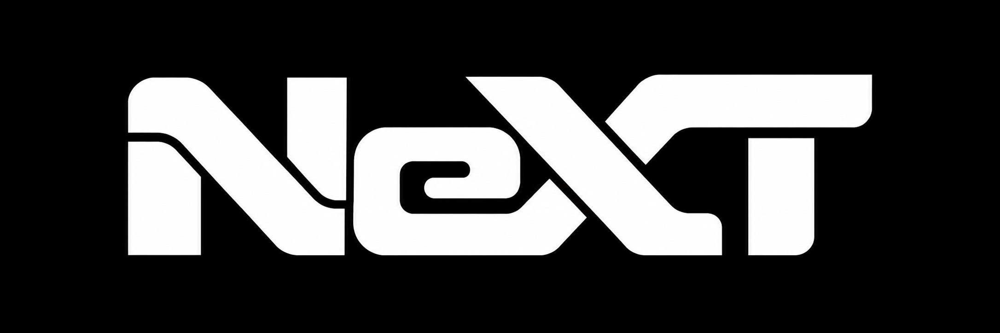

<a href="https://github.com/NV-Davyd/NeXT/releases/latest/download/NeXT-1.3.0.zip"><strong>Download NeXT 1.3.0</strong></a> · <a href="https://next-mod.pages.dev">Account</a>

NeXT is a mod for **CarX Drift Racing Online 2**, focused on improving and expanding the game experience.

The project is just getting started, with new features and improvements on the way.

## Install

1. Close the game. In Steam, open **Properties → Installed Files → Browse**.
2. Download the ZIP above and copy its contents into the game folder.
3. Launch the game and press **F10** to connect through Steam.

The first launch can take a little longer. Access requires approval.

**Updating from an older NeXT release?** Install the full 1.3.0 package once to enable automatic updates. Future launches check before the game opens: **OK** downloads, installs and restarts through Steam; **No** starts your installed version. Account approval and release restrictions still apply.

**Already using a customized BepInEx installation?** Copy `BepInEx/plugins/CarXTyres`, `BepInEx/NeXT`, `BepInEx/core/NeXT.Bootstrap.dll` and `BepInEx/licenses/NeXT-Updater-runtime.txt` from the ZIP. In `doorstop_config.ini`, set `target_assembly = BepInEx\core\NeXT.Bootstrap.dll`. Keep your other loader settings.

Your available controls are on your [account page](https://next-mod.pages.dev).

Windows · Steam build **25255628**
